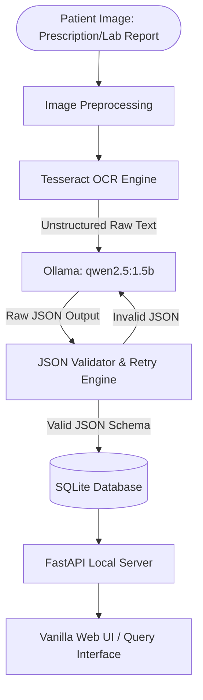

# MedScribe 🩺📝

[](https://www.gnu.org/licenses/agpl-3.0)
[](#model--runtime-declaration)
[](#offline-proof)

Turns photos of prescriptions and lab reports into structured, queryable records — **fully offline and running entirely on CPU**.

---

## 📌 Problem Statement

In many healthcare settings—particularly rural clinics, community health centers, and emergency response areas—internet connectivity is either unreliable or non-existent. Furthermore, transmitting highly sensitive patient health information (PHI) to cloud-based LLMs introduces significant privacy, security, and regulatory compliance risks (such as HIPAA).

Meanwhile, medical documents remain overwhelmingly paper-based or unstructured. Doctors' handwritten prescriptions are notoriously difficult to read, leading to potential medication errors. Lab reports, while printed, are stored as static sheets of paper, preventing automated analysis or easy structured querying.

**MedScribe** solves these problems by providing an **offline-first, privacy-preserving, CPU-only digitizer**. It processes images of prescriptions and lab reports locally on standard laptop hardware, performing text extraction and structured parsing without sending a single byte over the internet.

---

## ⚙️ Model + Runtime Declaration

MedScribe is strictly designed to operate without any external network dependency or cloud APIs. The entire pipeline uses the following local open-source tools:

*   **OCR Engine:** Tesseract OCR (via `pytesseract`) for initial raw text extraction from images.
*   **Local SLM (Small Language Model):** Ollama running `qwen2.5:1.5b` (fallback: `phi3.5:mini`) to parse unstructured OCR output into schema-conforming JSON.
*   **Database:** SQLite for local relational storage (queryable structured records, no vector database or external database servers required).
*   **API Framework:** FastAPI running locally to serve the web UI and expose ingestion endpoints.
*   **Hardware Target:** Standard CPU-only consumer laptops. No GPU required.

---

## 🏗️ System Architecture

The following diagram illustrates the flow of data through MedScribe, from ingestion to structured query:



---

## 🚀 Setup Instructions

Follow these steps to set up MedScribe on your local machine for offline execution:

### 1. Prerequisites
Ensure you have the following installed on your host system:
*   Python 3.10+
*   Tesseract OCR engine:
    *   **Windows:** Install via vcpkg or download installer (ensure `tesseract` is added to your PATH).
    *   **macOS:** `brew install tesseract`
    *   **Linux:** `sudo apt-get install tesseract-ocr`
*   [Ollama](https://ollama.com/) (local LLM runtime)

### 2. Download the Local Model
Start Ollama and pull the target Small Language Model:
```bash
# Pull the primary model
ollama pull qwen2.5:1.5b

# (Optional) Pull the fallback model
ollama pull phi3.5:mini
```

### 3. Clone and Scaffold
```bash
git clone https://code.swecha.org/shariquekhan/hackathon-3.git
cd hackathon-3
```

### 4. Set Up Python Virtual Environment
```bash
# Create and activate environment
python -m venv .venv
# On Windows (PowerShell):
.\.venv\Scripts\Activate.ps1
# On Linux/macOS:
source .venv/bin/activate

# Install dependencies
pip install -r requirements.txt
```

---

## 🔒 Offline Proof (Verification Guide)

To prove that MedScribe is 100% offline and does not leak any data, perform the following verification:

1.  **Turn off Wi-Fi/Ethernet:** Disconnect your machine completely from the internet.
2.  **Verify Ollama is local:** Run `ollama list` to confirm `qwen2.5:1.5b` is downloaded.
3.  **Run the verification script:**
    ```bash
    python src/verify_offline.py
    ```
4.  **Observe execution:** The script will load a sample image from `data/samples/`, run OCR via Tesseract, feed the text to Ollama, parse the JSON, and save it to the local SQLite database (`data/medscribe.db`) — all while the network interface is disabled.
